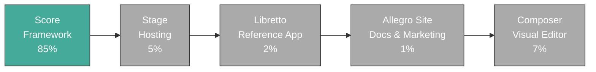

# Allegro Ecosystem PRD

_PRD · ecosystem_

---

## 1. Overview

Allegro is a Swift-first web ecosystem made of five products:

- **Score** — the framework and rendering/runtime foundation
- **Stage** — the hosting and operations product
- **Libretto** — the first-party reference application used to validate both
- **Allegro Site** — the canonical public site and documentation surface
- **Composer** — native macOS and iPad visual editor for Score projects

Each product has a hard boundary. They should reinforce each other without depending on private implementation details across those boundaries.

## 2. Systems Thesis

Most pages should be static. Runtime should appear only when the problem requires it. Performance and durability are product qualities, not optional polish.

### Principles

**Static is the base state.** Static output is the simplest correct answer for most web pages. Dynamic behaviour must justify its cost.

**Runtime is a capability.** Runtime is introduced to support side effects, persistence, authentication, or other server-backed behaviour. It is not a mode switch developers should have to micromanage.

**Progressive enhancement is required.** HTML carries structure and baseline usability. CSS improves presentation. JavaScript and server runtime add capability on top of that baseline instead of replacing it.

**Performance is correctness.** Slow output, excessive work, and unnecessary runtime are architecture failures, not merely optimisation opportunities.

**Durability matters when state matters.** If a feature crosses a network or writes durable state, retries, timeouts, idempotency, and bounded failure behaviour need to be part of the system design.

**Boundaries stay hard.** Score builds applications. Stage hosts workloads. Libretto proves the stack in production. These concerns reinforce each other, but they do not collapse into one product.

**Dependencies are architecture.** Every dependency changes the shape of the system. Curated dependencies are part of the product discipline, not a procurement detail.

**Narrow focus is intentional.** Allegro does not need to serve every web team. It needs to provide one coherent path for teams who value typed contracts, static-first delivery, and restrained system design.

The goal is not novelty. The goal is a web stack where the obvious path stays simple, the runtime boundary stays clear, and operational complexity appears only when it is truly needed.

## 3. Responsibilities

### Score

Owns application authoring, rendering contracts, runtime capabilities, and first-party package surfaces. See [Score PRD](score-prd.md).

### Stage

Owns deployment, execution, logs, environments, and workload hosting. See [Stage PRD](stage-prd.md).

### Libretto

Owns dogfooding. It is where Allegro proves that the framework and hosting story hold up under real product pressure. See [Section 10](#10-libretto).

### Allegro Site

Owns the public documentation and marketing surface for the ecosystem. See [Section 11](#11-allegro-site).

### Composer

Owns the native visual editing experience for Score projects. See [Composer PRD](composer-prd.md).

## 4. Delivery Order

The ecosystem builds in sequence:

1. Score becomes viable enough to build and ship real applications.
2. Stage becomes viable enough to host those applications well.
3. Libretto uses both in production and exposes the rough edges.
4. Allegro Site publishes ecosystem documentation.
5. Composer provides visual editing on top of the canonical CLI toolchain.

This order is not optional. Downstream products should not invent fake progress by speculating past the maturity of upstream ones.

## 5. Documentation Rules

- Product docs must distinguish clearly between current implementation and future direction.
- Package targets are not equivalent to finished subsystems.
- Package/module names should match the codebase exactly.
- Placeholder modules may be named, but must not be described as complete systems.
- Repeated doctrine should live in the owning PRD once, then be referenced elsewhere instead of duplicated.

## 6. Boundary Rules

- Score builds applications. Stage hosts them.
- Stage infrastructure must not depend on Score internals.
- Stage marketing and dashboard surfaces may use Score when useful.
- Libretto should use supported Score and Stage paths rather than custom escape hatches.

## 7. Dependency Policy

Dependencies across the ecosystem are restricted to approved Swift Package Index collections. The approved sources are:

| Source | Collection URL |
| --- | --- |
| Apple | https://swiftpackageindex.com/apple/collection.json |
| Swift.org | https://swiftpackageindex.com/swiftlang/collection.json |
| SSWG | https://swiftpackageindex.com/swift-server/collection.json |
| Swift Server Community | https://swiftpackageindex.com/swift-server-community/collection.json |

Packages outside these collections require explicit approval and written justification before adoption.

### Approved Swift Dependencies

- **swift-nio** — underlying networking layer for server runtime
- **swift-http-types** — HTTP request/response type contracts
- **Noora** (tuist/Noora) — CLI interface rendering for Score CLI tools

### Approved JavaScript Dependencies

| Dependency | Purpose | Scope |
| --- | --- | --- |
| `signal-polyfill` | TC39 Signals polyfill for browser reactivity | Client-side runtime |
| `@js-temporal/polyfill` | Temporal API polyfill | Client-side runtime |

No other client-side JavaScript runtime dependencies are permitted without explicit approval.

### Adding a New Dependency

1. Verify it exists in one of the approved Swift Package Index collections.
2. Confirm the functionality is not already available in an existing approved dependency.
3. Prefer existing dependencies over writing custom code when the functionality is well-covered.
4. If the dependency is outside approved sources, open a written justification and record the exception here upon approval.

## 8. Success Criteria

- Score is capable enough to build credible Swift web applications.
- Stage can host Score workloads without becoming Score-coupled infrastructure.
- Libretto validates the real operating shape of the stack.

## 9. Build Progress

Score -> Stage -> Libretto -> Allegro Site -> Composer

| Phase | Status | Progress | Notes |
| --- | --- | --- | --- |
| Score | In Progress | 85% | Core + HTML/CSS/Router/Runtime + Storage + Auth + Content + Assets + UI + Vendor all implemented and covered; CLI tooling and examples pending |
| Stage | Planning | 5% | Product boundary is defined, implementation has not started |
| Libretto | Planning | 2% | Reference application remains downstream of Stage |
| Allegro Site | Planning | 1% | Public docs and product surface is defined at a high level, implementation has not started |
| Composer | Planning | 7% | Product boundary and architecture are now defined; implementation has not started |

### Score Progress

Status: **In Progress** — Progress: **85%**

- [x] PRD + RFC complete
- [x] ScoreCore - node protocol, result builder, application/theme/metadata/routing contracts
- [x] ScoreHTML - HTML renderer with broad node coverage and conformance documentation
- [x] ScoreCSS - modifier emission, stylesheet rule deduplication, and conformance documentation
- [x] ScoreRouter - route table compilation, path matching with parameter extraction, 404/405 error handling
- [x] ScoreRuntime - HTTP server, page renderer, CSS/JS pipeline, reactive model (@State/@Computed/@Action), event bindings, JS emitter, dev/prod environments
- [x] ScoreStorage - unified transactional KV store with FoundationDB-compatible protocol, InMemoryStore for local dev, TTL, transactions, scan, increment
- [x] ScoreAuth - Magic Link email auth, Passkey challenge/credential types, session lifecycle, CSRF tokens, email configuration
- [x] ScoreContent - Markdown-to-Node conversion, 12 built-in syntax themes, code blocks with filename/copy/line numbers, MathML rendering, front matter parsing, content collections
- [x] ScoreAssets - SHA256 fingerprinting, asset manifest, 24 MIME types, gzip optimization, asset pipeline orchestration
- [x] ScoreUI - 30 shadcn-equivalent components
- [x] ScoreVendor - Script node for third-party injection, Analytics providers, VendorIntegration protocol
- [ ] CLI tooling (`score init`, `score dev`, `score build`, `score deploy`)
- [ ] Full-stack web parity (drag-and-drop, file uploads, CORS, compression, JWT, OAuth, Stripe, ScoreData, WebSocket, testing)
- [ ] Canonical example applications (9 `score init` templates)
- [ ] v1.0.0 release
- [ ] Secure repo controls

### Stage Progress

Status: **Planning** — Progress: **5%**

- [x] PRD complete
- [ ] Local development flow
- [ ] Static hosting
- [ ] Runtime hosting
- [ ] Deployment and logs
- [ ] Dashboard and docs
- [ ] Self-hosted mode
- [ ] v1.0.0 release
- [ ] Secure repo controls

### Libretto Progress

Status: **Planning** — Progress: **2%**

- [x] PRD complete
- [ ] Product requirements
- [ ] First usable build
- [ ] Production dogfooding of Score + Stage
- [ ] Public launch
- [ ] v1.0.0 release
- [ ] Secure repo controls

### Allegro Site Progress

Status: **Planning** — Progress: **1%**

- [ ] PRD complete
- [ ] Handbook publishing model
- [ ] Score API and guide documentation integration
- [ ] Stage documentation integration
- [ ] Libretto documentation and narrative integration
- [ ] Information architecture and navigation model
- [ ] First production deploy
- [ ] v1.0.0 release
- [ ] Secure repo controls

### Composer Progress

Status: **Planning** — Progress: **7%**

- [x] PRD complete
- [ ] Native app shell (macOS)
- [ ] Native app shell (iPad)
- [ ] Single-worker project hydration/eviction model
- [ ] Local `score dev` integration (watch/preview/errors)
- [ ] Local `score build` integration
- [ ] Publish flow to Stage (`score deploy` parity)
- [ ] Capability manifest UX surfacing
- [ ] v1.0.0 release
- [ ] Secure repo controls

### Post-v1 Repository Controls

Applies immediately when each repository reaches `v1.0.0`:

- `main` is PR-only (no direct pushes).
- Pull requests into `main` must pass required checks from `.github/workflows/ci.yml`.
- Force pushing to `main` is disabled.
- Pushes to `main` are rejected, including attempts with local `--no-verify`.

## 10. Libretto

### Overview

Libretto is the first-party reference application in the Allegro ecosystem. It exists to validate Score and Stage under real product pressure and turn operational and UX learnings into concrete upstream requirements.

### Problem Domain

Most creative professionals and small teams lack a unified place to plan, draft, and publish written work. Libretto is a focused writing and publishing workspace. It lets individuals and small teams move from early notes through structured drafts to published pages, all within a single product.

The domain exercises the full depth of Score's capabilities: content authoring (ScoreContent), persistent storage (ScoreStorage), authentication (ScoreAuth), asset management (ScoreAssets), interactive UI (ScoreUI with reactive state), and server-side routing/rendering (ScoreRuntime).

### Target Audience

**Primary:** Independent writers and small creative teams who produce essays, articles, documentation, newsletters, or long-form content.

**Secondary:** Allegro ecosystem evaluators who want to see what a real Score application looks like in production.

### Product Goals

- Prove Score can support credible product development beyond framework demos.
- Prove Stage can host and operate the product through supported public workflows.
- Provide a dogfooding loop that continuously improves Score and Stage.
- Demonstrate Allegro design and interaction standards in a shipped product.

### Core Feature Set

**Phase 1 — Foundation:** Workspace and authentication (magic link + passkey), document editor (Markdown-native with live preview), document management (CRUD with search/sort), publishing (one-click to public URL with SSR).

**Phase 2 — Depth:** Collections, asset handling, theming, revision history, custom domains.

**Phase 3 — Collaboration:** Team workspaces, comments/annotations, analytics, newsletter delivery, API access.

### Score Integration Points

| Score Module | Libretto Usage |
|---|---|
| ScoreCore | Node tree for all page and component rendering |
| ScoreHTML | Server-side HTML emission for published pages and editor UI |
| ScoreCSS | Modifier-based styling, theme variables, responsive layout |
| ScoreRouter | Route table for editor, published content, auth flows, and API |
| ScoreRuntime | HTTP server, document assembly, reactive state in editor UI |
| ScoreStorage | Document storage, user records, workspace data, revision history |
| ScoreAuth | Magic link auth, passkey auth, sessions, CSRF |
| ScoreContent | Markdown-to-Node rendering for preview and published output |
| ScoreAssets | Image fingerprinting, asset manifest, MIME handling |
| ScoreUI | Editor controls, navigation, dialogs, toasts, command palette |
| ScoreVendor | Analytics integration for published content |

### Data Model

All persistent state uses ScoreStorage transactional KV with structured tuple keys:

- `workspace / {workspaceId}` — workspace metadata
- `workspace / {workspaceId} / documents / {documentId}` — document records
- `workspace / {workspaceId} / collections / {collectionId}` — collection metadata
- `workspace / {workspaceId} / assets / {assetId}` — asset metadata
- `workspace / {workspaceId} / revisions / {documentId} / {timestamp}` — revision snapshots
- `user / {userId}` — user records
- `index_by_email / {email} / {userId}` — email lookup index
- `index_by_slug / {workspaceId} / {slug} / {documentId}` — published URL lookup

### Brand

`Libretto` wordmark with small cursive `by Allegro` in the bottom-right of the lockup.

### Success Criteria

- Built and operated fully through supported Score and Stage paths.
- Usage produces concrete platform improvements filed as upstream issues.
- At least one real user outside the Allegro team uses Libretto for actual writing and publishing.
- The codebase serves as a credible reference implementation for developers evaluating Score.

## 11. Allegro Site

### Overview

Allegro Site is the canonical public site for the ecosystem. It unifies handbook doctrine, product boundaries, and implementation documentation into one coherent surface.

### Product Goals

- Provide a clear public entry point for Allegro.
- Publish handbook doctrine and product requirements as first-class docs.
- Aggregate documentation from Score libraries and Libretto.
- Keep navigation coherent across doctrine, PRDs, and implementation docs.
- Apply Allegro design philosophy to docs UX and presentation.

### Content Scope

The site includes: handbook content (manifesto, philosophy, PRDs, progress), Score documentation (guides, module docs, API references, examples), Stage documentation, and Libretto documentation.

> [!NOTE]
> The first page of each documentation section should be a marketing page for that product e.g. show features, benefits and quick examples on that page.

### Information Architecture

- Separate current implementation from future direction.
- Keep hierarchy shallow and legible.
- Preserve direct links between ecosystem doctrine and implementation docs.
- Avoid duplicate source-of-truth documents.

### Success Criteria

- Users can move from doctrine to actionable implementation docs without ambiguity.
- Handbook and implementation docs remain synchronized with source repositories.
- Allegro Site becomes the canonical public docs surface for the ecosystem.

## 12. Glossary

### Ecosystem

**Allegro** — the umbrella name for the Swift-first web ecosystem comprising Score, Stage, Libretto, Allegro Site, and Composer.

**Score** — the Swift web framework package. Owns application authoring, rendering, runtime capabilities, and first-party package surfaces.

**Stage** — the hosting and operations product. Runs workloads produced by Score without coupling infrastructure to Score internals.

**Libretto** — the first-party reference application. Validates Score and Stage under real product pressure.

**Allegro Site** — the canonical public site and documentation surface for the ecosystem.

**Composer** — the native macOS and iPad visual editor for Score projects. A thin orchestration layer over canonical Score CLI workflows.

### Score Authoring Model

**Node** — the core protocol in `ScoreCore` that all renderable elements conform to.

**NodeBuilder** — the result builder that enables declarative Swift syntax for composing `Node` trees.

**Modifier** — a value attached to a `Node` that describes presentational and behavioral attributes. Modifiers lower to CSS declarations through `ScoreCSS`.

**Application** — the root protocol for a Score project. Registers pages, controllers, theme, and metadata. Application-scoped `@State` compiles to module-level `Signal.State` singletons shared across all pages and elements.

**Page** — a protocol declaring a static path, optional metadata patch, and a `Node` body. Page-scoped `@State` compiles to module-scoped signals torn down on navigation.

**Element** — a protocol for reusable interactive UI units. Element-scoped `@State` compiles to instance-scoped signals inside a factory function, isolated per mount.

**Controller** — a protocol that groups `Route` values under a base path for request handling.

**Route** — an individual endpoint within a `Controller` that handles HTTP requests.

**Theme** — an optional declaration providing semantic color roles, typography, spacing, radius, and syntax highlighting configuration.

**ThemePatch** — the additive override mechanism for dark mode and named theme variants.

**Metadata** / **MetadataPatch** — baseline and per-page rendering inputs (title, description, Open Graph).

**Component** — a protocol for reusable `Node` compositions with a `body` property.

**Entity** — a protocol for model types representing persistent or transferable data records.

**HTTPMiddleware** — a closure-based request interceptor for cross-cutting concerns.

**VendorIntegration** — a protocol in `ScoreVendor` for third-party script injection.

### Runtime

**Capability** — a feature flag in the build manifest indicating which runtime features a project requires.

**Signal** — the reactive primitive backing Score's browser runtime. `@State` lowers to `Signal.State`, `@Computed` lowers to `Signal.Computed`. Signals are an internal runtime detail, not a public Swift API.

**Progressive Enhancement** — the requirement that HTML carries structure and baseline usability, with CSS and JavaScript adding capability on top.

### Storage

**Transactional KV Store** — Score's single persistence methodology. A key-value database abstraction backed by FoundationDB in production and a lightweight API-compatible engine locally.

**Transaction** — an atomic unit of work against the KV store.

### Build and CLI

**`score init`** — generates a canonical Score project from a built-in template.

**`score dev`** — watches project files, recompiles on save, serves local preview with hot reload.

**`score build`** — performs full compilation, produces deterministic output in `.build/score/`.

**`score deploy`** — packages and submits a project snapshot to Stage for remote production build.

**Build Artifact** — the contents of `.build/score/` after a successful build.

**Deterministic Build** — the invariant that identical inputs produce byte-equivalent outputs.

## 13. Architecture Decision Records

### ADR-001: FoundationDB-Backed Transactional KV Store

**Status:** Accepted

Score uses a single transactional key-value database abstraction. Production deployments are backed by FoundationDB. Local development uses a lightweight API-compatible engine. The storage API is intentionally minimal: `get`, `set`, `delete`, `scan`, and transactional atomic operations. No SQL, implicit joins, or query planners in the core.

### ADR-002: TC39 Signals Polyfill for Browser Reactivity

**Status:** Accepted

Score's browser runtime targets the TC39 Signals polyfill (`signal-polyfill` npm package) as its reactive engine. `@State` lowers to `Signal.State`, `@Computed` lowers to `Signal.Computed`, `@Action` lowers to compiler-emitted JavaScript functions. Three state scopes (Application, Page, Element) map to different signal lifetimes. When native browser signals become viable, Score can swap its internal engine without changing the public Swift authoring model.

### ADR-003: Single-Worker Composer Model

**Status:** Accepted

Composer runs exactly one sandboxed worker at a time. One project is hydrated, inactive projects are compressed and evicted, and no concurrent build containers run inside Composer.

### ADR-004: Swift 6 Strict Concurrency

**Status:** Accepted

All Score code targets Swift 6 strict concurrency. All `Node` types and public protocol conformances must be `Sendable`. The codebase uses structured concurrency.

### ADR-005: Static-First Output as Default

**Status:** Accepted

Static output is the default model for all Score projects. Runtime capabilities are opt-in and only activate when required by project features. The capability manifest enforces this at build and deploy time.

### ADR-006: Deterministic Build Invariant

**Status:** Accepted

Given identical project input, Score version, Swift toolchain version, and build settings, Score must produce byte-equivalent build outputs across compliant environments.

### ADR-007: Three-Level Signal State Model

**Status:** Accepted

Score's browser runtime uses three distinct signal state scopes that map to Swift protocol conformances:

- **Application** (`Application` conformance) — `@State` compiles to module-level `Signal.State` singletons exported from `app.js`. Shared across all pages and elements. Lifetime: entire application session.
- **Page** (`Page` conformance) — `@State` compiles to module-scoped (non-exported) `Signal.State` in page JS modules. Torn down on navigation. Lifetime: page mount to unmount.
- **Element** (`Element` conformance) — `@State` compiles to instance-scoped `Signal.State` inside a factory function. Each DOM mount gets its own isolated signal graph. Lifetime: element mount to unmount.

This maps cleanly to the TC39 Signals API: `Signal.State` for mutable state, `Signal.Computed` for derived values, and compiler-emitted effects for DOM bindings.

## 14. Changelog

### 2026-03-09

- Consolidated handbook into per-project PRD files (ecosystem, score, stage, composer).
- Added style guide to design-philosophy.md (fonts, color tokens, syntax highlighting, scope colors).
- Updated Score PRD state model to three-level signal architecture (Application/Page/Element).
- Added `signal-polyfill` to approved JavaScript dependencies.
- Added ADR-007 for three-level signal state model.

### 2026-03-08

- Reconciled handbook with canonical examples.
- Added `taskboard` to Score PRD template list.
- Added `Vendors/` to canonical directory structure.
- Expanded glossary with `Component`, `Entity`, `HTTPMiddleware`, and `VendorIntegration` definitions.

### 2026-03-06

- Added changelog, glossary, dependencies, decisions, and CLI PRD as standalone documents.
- Added Mermaid build-sequence diagram to progress.

### 2026-03-05

- Conducted full handbook audit.
- Added Composer PRD.
- Moved dependency policy into ecosystem PRD.

### 2026-02

- Added Composer PRD.
- Completed Score PRD Sections 9-10 (runtime model, storage, planned subsystems).

### 2026-01

- Expanded Score PRD with delivered modules.
- Added allegro-site-prd, libretto-prd, stage-prd.

### 2025

- Created handbook as linked Markdown files (migrated from single handbook.html).
- Established manifesto, design philosophy, ecosystem PRD, score PRD, progress tracking.
