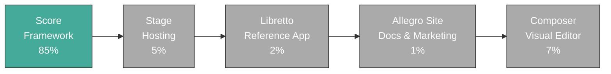

# Allegro Build Progress

[Handbook Index](README.md) | [Progress](progress.md) | [Systems Manifesto](manifesto.md) | [Design Philosophy](design-philosophy.md) | [Ecosystem PRD](ecosystem-prd.md) | [Allegro Score PRD](score-prd.md) | [Allegro Stage PRD](stage-prd.md) | [Allegro Libretto PRD](libretto-prd.md) | [Allegro Site PRD](allegro-site-prd.md) | [Allegro Composer PRD](composer-prd.md) | [CLI PRD](cli-prd.md) | [Glossary](glossary.md) | [Dependencies](dependencies.md) | [Decisions](decisions.md) | [Changelog](changelog.md)

Score -> Stage -> Libretto -> Allegro Site -> Composer

## Build Sequence

Each product is unblocked by the one before it. Downstream products should not invent fake progress by speculating past the maturity of upstream ones.

## Summary

| Phase | Status | Progress | Notes |
| --- | --- | --- | --- |
| Score | In Progress | 85% | Core + HTML/CSS/Router/Runtime + Storage + Auth + Content + Assets + UI + Vendor all implemented and covered; CLI tooling and examples pending |
| Stage | Planning | 5% | Product boundary is defined, implementation has not started |
| Libretto | Planning | 2% | Reference application remains downstream of Stage |
| Allegro Site | Planning | 1% | Public docs and product surface is defined at a high level, implementation has not started |
| Composer | Planning | 7% | Product boundary and architecture are now defined; implementation has not started |

## Score

Status: **In Progress**

Progress: **85%**

- Swift web framework

- [x] PRD + RFC complete
- [x] ScoreCore - node protocol, result builder, application/theme/metadata/routing contracts
- [x] ScoreHTML - HTML renderer with broad node coverage and conformance documentation
- [x] ScoreCSS - modifier emission, stylesheet rule deduplication, and conformance documentation
- [x] ScoreRouter - route table compilation, path matching with parameter extraction, 404/405 error handling
- [x] ScoreRuntime - HTTP server, page renderer, CSS/JS pipeline, reactive model (@State/@Computed/@Action), event bindings, JS emitter, dev/prod environments
- [x] ScoreStorage - unified transactional KV store with FoundationDB-compatible protocol, InMemoryStore for local dev, TTL, transactions, scan, increment
- [x] ScoreAuth - Magic Link email auth, Passkey challenge/credential types, session lifecycle, CSRF tokens, email configuration
- [x] ScoreContent - Markdown-to-Node conversion, 12 built-in syntax themes, code blocks with filename/copy/line numbers, MathML rendering, front matter parsing, content collections
- [x] ScoreAssets - SHA256 fingerprinting, asset manifest, 24 MIME types, gzip optimization, asset pipeline orchestration
- [x] ScoreUI - 30 shadcn-equivalent components (Accordion, Alert, Avatar, Badge, Breadcrumb, Button variants, Card, Checkbox, CommandPalette, Dialog, Dropdown, Input, Label, LocalePicker, NavBar, Pagination, Progress, RadioGroup, Select, Separator, Sheet, Skeleton, Slider, Switch, Table, Tabs, Textarea, Toast, Toggle, Tooltip)
- [x] ScoreVendor - Script node for third-party injection, Analytics providers (Google Analytics, Plausible, custom), VendorIntegration protocol
- [ ] CLI tooling (`score init`, `score dev`, `score build`, `score deploy`)
- [ ] Full-stack web parity (drag-and-drop, file uploads, CORS, compression, JWT, OAuth, Stripe, ScoreData, WebSocket, testing)
- [ ] Canonical example applications (9 `score init` templates)
- [ ] v1.0.0 release
- [ ] Secure repo controls

## Stage

Status: **Planning**

Progress: **5%**

- Swift-native hosting platform
- Unblocked by: Score v1.0.0

- [x] PRD complete
- [ ] Local development flow
- [ ] Static hosting
- [ ] Runtime hosting
- [ ] Deployment and logs
- [ ] Dashboard and docs
- [ ] Self-hosted mode
- [ ] v1.0.0 release
- [ ] Secure repo controls

## Libretto

Status: **Planning**

Progress: **2%**

- First-party reference app
- Unblocked by: Stage v1.0.0
- Wordmark note: `Libretto` with a small cursive `by Allegro` in the bottom-right lockup

- [x] PRD complete
- [ ] Product requirements
- [ ] First usable build
- [ ] Production dogfooding of Score + Stage
- [ ] Public launch
- [ ] v1.0.0 release
- [ ] Secure repo controls

## Allegro Site

Status: **Planning**

Progress: **1%**

- Public site and documentation surface
- Unblocked by: Libretto v1.0.0

- [ ] PRD complete
- [ ] Handbook publishing model
- [ ] Score API and guide documentation integration
- [ ] Stage documentation integration
- [ ] Libretto documentation and narrative integration
- [ ] Information architecture and navigation model
- [ ] First production deploy
- [ ] v1.0.0 release
- [ ] Secure repo controls

## Composer

Status: **Planning**

Progress: **7%**

- Native visual editor for Score (macOS + iPad)
- Unblocked by: Allegro Site v1.0.0

- [x] PRD complete
- [ ] Native app shell (macOS)
- [ ] Native app shell (iPad)
- [ ] Single-worker project hydration/eviction model
- [ ] Local `score dev` integration (watch/preview/errors)
- [ ] Local `score build` integration
- [ ] Publish flow to Stage (`score deploy` parity)
- [ ] Capability manifest UX surfacing
- [ ] v1.0.0 release
- [ ] Secure repo controls

Previous: [Handbook Index](README.md)
Next: [Systems Manifesto](manifesto.md)

## Post-v1 Repository Controls

Applies immediately when each repository reaches `v1.0.0`:

- `main` is PR-only (no direct pushes).
- Pull requests into `main` must pass required checks from `.github/workflows/ci.yml`.
- Force pushing to `main` is disabled.
- Pushes to `main` are rejected, including attempts with local `--no-verify`.
